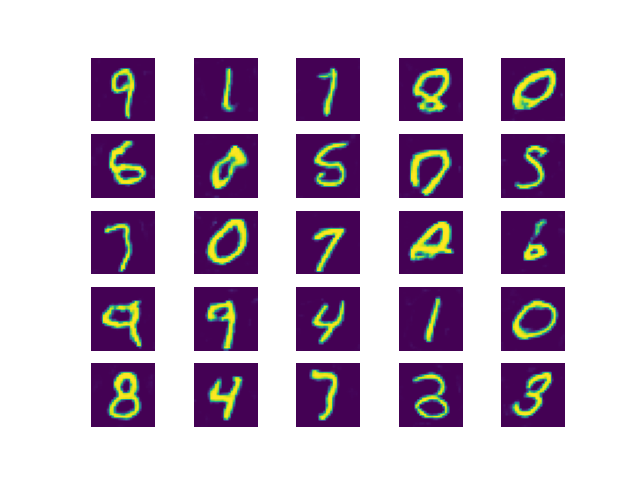
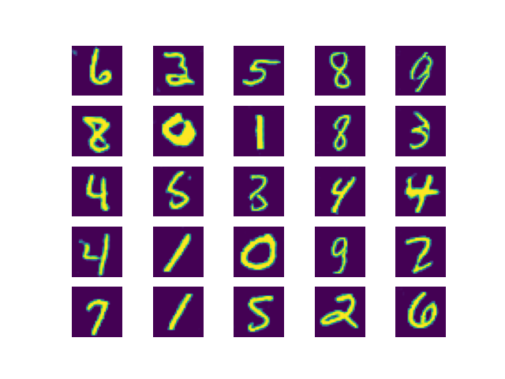

# MNIST Deep Convolutional GAN

This is an implementation of a DCGAN which trains on MNIST data in order to generate images of written digits.

[For faster training, it is recommended to run tensorflow on GPU. For reference, it takes a few hours (depending on the number of epochs) for this code to run on NVIDIA GeForce GTX 1660.
For more information check out https://www.tensorflow.org/install/gpu]

Here is an example of some randomly chosen generated images at epoch 20 vs. epoch 200:
 
